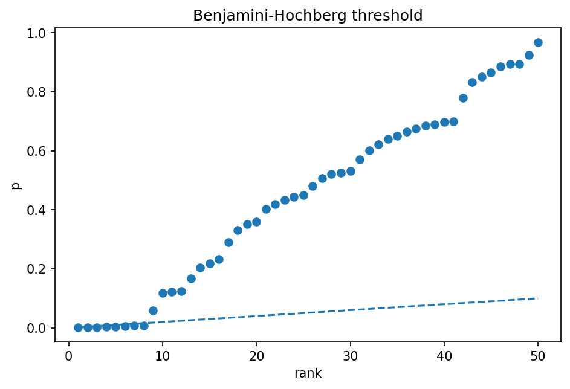

# 多重検定とFDR

Course 03｜確率統計

---

## 何を解決するか

何百・何千個も検定すると、なぜ偶然の有意差が増え、どう制御するか。

各検定の誤陽性率が小さくても、検定数が増えると少なくとも1つ誤陽性を出す確率が上がる。FWERとFDRは異なる誤り基準を制御する。

---

## 図の意味

p値を小さい順に並べ、横軸が順位 $i$、縦軸が $p_{(i)}$。斜め破線はBenjamini–Hochbergの閾値 $iq/m$。破線以下にある最大順位 $k$ を探し、$p_{(1)},\dots,p_{(k)}$ を棄却する。単一の0.05水平線ではない点がFDR制御の特徴。

---

## 記号

| 記号 | 意味 |
|---|---|
| $m$ | 検定数 |
| $V$ | 偽陽性数 |
| $R$ | 棄却数 |
| $FDR$ | E[V/max(R,1)] |

- $m$：検定数。
- $R$：棄却数（discoveries）。
- $V$：そのうち真の帰無仮説を誤って棄却した数。
- $q$：目標FDR水準。

---

## 中心式

$$
\mathrm{FDR}=E\left[\frac{V}{\max(R,1)}\right]
$$

---

## 導出

1. 多数のp値を得る。
2. Benjamini–Hochbergでは昇順 p_(i) と i q/m を比較する。
3. 条件を満たす最大iまでを棄却し、発見集合中の偽発見割合を平均的に制御する。

---

## 省略しない一段

m個すべての帰無仮説が真で独立なら、各検定を0.05で行うと期待誤陽性数は $0.05m$。FWERは「1つでも誤る確率」、FDRは発見集合の中の偽発見割合の期待値で、目的が異なる。

BH法ではp値を昇順に並べ、$p_{(i)}\le iq/m$ を満たす最大iを選ぶ。順位が大きいほど許容閾値も大きくなるが、発見数Rとの比としてfalse discoveriesを制御する。

---

## 手計算

**問題**：$m=6$, $q=0.05$, p値が $0.004,0.011,0.019,0.041,0.20,0.70$ のときBH法で棄却する仮説数を求めよ。

**解答**：閾値 $iq/m$ は約0.00833,0.01667,0.025,0.03333,0.04167,0.05。条件を満たすのはi=1,2,3で、i=4は0.041>0.03333。最大k=3なので最初の3仮説を棄却する。

---

## 条件を変える

$m=5$, $q=0.1$, $p=(0.005,0.02,0.04,0.2,0.8)$。閾値は $(0.02,0.04,0.06,0.08,0.1)$。最初の3つが条件を満たし、最大k=3なので3仮説を棄却する。

---

## どこで壊れるか

BHは任意の依存構造で無条件に同じ保証を持つわけではない。依存性が強い場合は前提を確認する。またFDR 5%は「各棄却仮説が5%の確率で偽」という意味ではない。

---

## 次へ

omics・画像・大規模A/B testなど多数仮説で不可欠。selective inferenceやfalse discovery exceedanceなど、選択後推論の問題へ広がる。

---

[教科書](../../textbook/stat-multiple-testing-fdr)　|　[10問の演習](../../exercises/stat-multiple-testing-fdr)

---

## 今回の問い

「多重検定とFDR」は何を表し、どの条件で使え、結果をどう検算するのか？

---

## 到達目標

- 何百・何千個も検定すると、なぜ偶然の有意差が増え、どう制御するか。
- 中心式の記号と成立条件を説明できる
- 小さい例と反例で検算できる

---

## 理解確認

1. 何百・何千個も検定すると、なぜ偶然の有意差が増え、どう制御するか。
2. 中心式の記号と成立条件を説明できる
3. 小さい例と反例で検算できる
