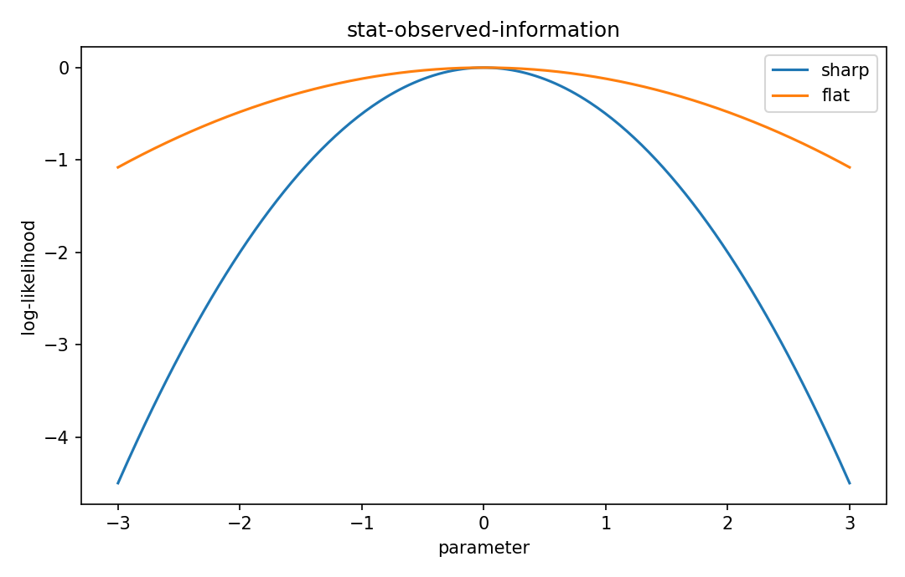

# Observed information

Fisher情報・統計推定

---

## 問い

期待Hessianではなく、実際に得たdatasetのlikelihood curvatureをどう測るか。

---

## 記号とshape

- `$\mathbf J`: observed information (p\times p)
- `$\mathbf I=E[\mathbf J]`: expected Fisher information (p\times p)

---

## 中心式

$$
\mathbf J(\boldsymbol\theta)=-\nabla_{\boldsymbol\theta}^2\ell(\boldsymbol\theta;\mathbf y)
$$

---

## 導出

- 1 datasetのlog-likelihoodをparameterで二回微分する。
- そのnegative Hessianをobserved informationと呼ぶ。
- dataについて期待値を取るとregularity条件下でFisher informationへ戻る。

---

## 図

---

## 小さな例

Gaussian meanでvariance既知ならobserved curvatureはdataに依らずn/σ²だが、非線形modelではdatasetごとに変化する。

---

## 何がわかるか

Newton法、Laplace approximation、dataset-specific uncertainty estimate。

---

## 失敗条件

Hessianがindefiniteな点はMLE近傍の局所maximumでない可能性がある。単純にinverseしてstandard errorにしない。

---

## 実装検算

MLE点でautodiff Hessianを計算し、eigenvalueが正のobserved informationになるか確認する。

---

## 式の読み方を固定する

Observed informationでは、likelihoodまたはestimating equationから得られる局所曲率・感度と、推定量のばらつきを区別する。$\mathbf J$ は observed information（p\times p）、$\mathbf I=E[\mathbf J]$ は expected Fisher information（p\times p）。中心式 `\mathbf J(\boldsymbol\theta)=-\nabla_{\boldsymbol\theta}^2\ell(\boldsymbol\theta;\mathbf y)` の行列が大きい/小さいとはどのparameter方向についての話かをeigenvectorまで含めて読む。対角要素だけを見るとparameter間のtrade-offを失う。

---

## 極限・反例で検算

- 手計算例: Gaussian meanでvariance既知ならobserved curvatureはdataに依らずn/σ²だが、非線形modelではdatasetごとに変化する。
- 失敗条件: Hessianがindefiniteな点はMLE近傍の局所maximumでない可能性がある。単純にinverseしてstandard errorにしない。
- 実装検算: MLE点でautodiff Hessianを計算し、eigenvalueが正のobserved informationになるか確認する。

---

## 工学での位置づけ

Newton法、Laplace approximation、dataset-specific uncertainty estimate。

中心式 `\mathbf J(\boldsymbol\theta)=-\nabla_{\boldsymbol\theta}^2\ell(\boldsymbol\theta;\mathbf y)` のどの量が観測・未知parameter・weight・frequency成分に対応するかを区別する。

---

## 試験で書けるべきこと

- `Observed information` の記号とshapeを定義する
- `1 datasetのlog-likelihoodをparameterで二回微分する。` から中心式を導く
- `Gaussian meanでvariance既知ならobserved curvatureはdataに依らずn/σ²だが、非線形modelではdatasetごとに変化する。` を最後まで追う
- `Hessianがindefiniteな点はMLE近傍の局所maximumでない可能性がある。単純にinverseしてstandard errorにしない。` がなぜ問題か説明する

---

## 接続

Prerequisites: stat-likelihood-maximum-likelihood, stat-fisher-information-matrix

[教科書](../../textbook/stat-observed-information)
[10問の演習](../../exercises/stat-observed-information)
