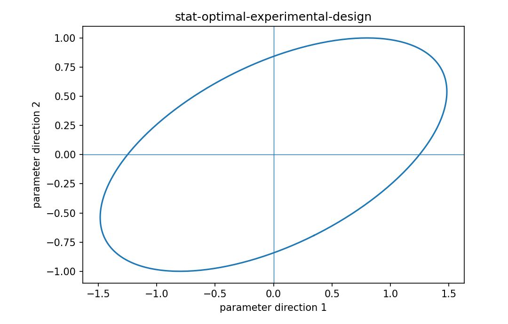

# Optimal experimental design

Fisher情報・統計推定

---

## 問い

Fisher情報行列をscalar objectiveへ変換してdesignを最適化する代表基準は何か。

---

## 記号とshape

- `$\mathbf I(\xi)`: information matrix (p\times p)
- `$D-optimality`: maximize information ellipsoid volume reduction (criterion)
- `$A-optimality`: minimize average variance (criterion)

---

## 中心式

$$
D\text{-optimal}:\ \max_\xi\log\det\mathbf I(\xi),\quad A\text{-optimal}:\ \min_\xi\operatorname{tr}(\mathbf I(\xi)^{-1})
$$

---

## 導出

- parameter covariance lower boundを $\mathbf I^{-1}$ と結ぶ。
- どのscalar summaryを重視するかでA/D/E-optimalityを定義する。
- D-optではdetの積、A-optではvariance対角和という異なるtrade-offが生じる。

---

## 図

---

## 小さな例

information eigenvaluesが(10,1)と(4,4)ならdetは10 vs16でD-optは後者、trace inverseは1.1 vs0.5でA-optも後者を好む。

---

## 何がわかるか

panel design、sensor geometry、sampling scheduleの数理最適化。

---

## 失敗条件

criterionが違えばdesignも変わる。logdetが高くても特定parameterのvarianceが目的に合うとは限らない。

---

## 実装検算

candidate information matricesでA/D/E criteriaを一覧化し、選択がどう変わるか確認する。

---

## 式の読み方を固定する

Optimal experimental designでは、likelihoodまたはestimating equationから得られる局所曲率・感度と、推定量のばらつきを区別する。$\mathbf I(\xi)$ は information matrix（p\times p）、$D-optimality$ は maximize information ellipsoid volume reduction（criterion）、$A-optimality$ は minimize average variance（criterion）。中心式 `D\text{-optimal}:\ \max_\xi\log\det\mathbf I(\xi),\quad A\text{-optimal}:\ \min_\xi\operatorname{tr}(\mathbf I(\xi)^{-1})` の行列が大きい/小さいとはどのparameter方向についての話かをeigenvectorまで含めて読む。対角要素だけを見るとparameter間のtrade-offを失う。

---

## 極限・反例で検算

- 手計算例: information eigenvaluesが(10,1)と(4,4)ならdetは10 vs16でD-optは後者、trace inverseは1.1 vs0.5でA-optも後者を好む。
- 失敗条件: criterionが違えばdesignも変わる。logdetが高くても特定parameterのvarianceが目的に合うとは限らない。
- 実装検算: candidate information matricesでA/D/E criteriaを一覧化し、選択がどう変わるか確認する。

---

## 工学での位置づけ

panel design、sensor geometry、sampling scheduleの数理最適化。

中心式 `D\text{-optimal}:\ \max_\xi\log\det\mathbf I(\xi),\quad A\text{-optimal}:\ \min_\xi\operatorname{tr}(\mathbf I(\xi)^{-1})` のどの量が観測・未知parameter・weight・frequency成分に対応するかを区別する。

---

## 試験で書けるべきこと

- `Optimal experimental design` の記号とshapeを定義する
- `parameter covariance lower boundを $\mathbf I^{-1}$ と結ぶ。` から中心式を導く
- `information eigenvaluesが(10,1)と(4,4)ならdetは10 vs16でD-optは後者、trace inverseは1.1 vs0.5でA-optも後者を好む。` を最後まで追う
- `criterionが違えばdesignも変わる。logdetが高くても特定parameterのvarianceが目的に合うとは限らない。` がなぜ問題か説明する

---

## 接続

Prerequisites: stat-experimental-design, stat-fisher-information-matrix

[教科書](../../textbook/stat-optimal-experimental-design)
[10問の演習](../../exercises/stat-optimal-experimental-design)
