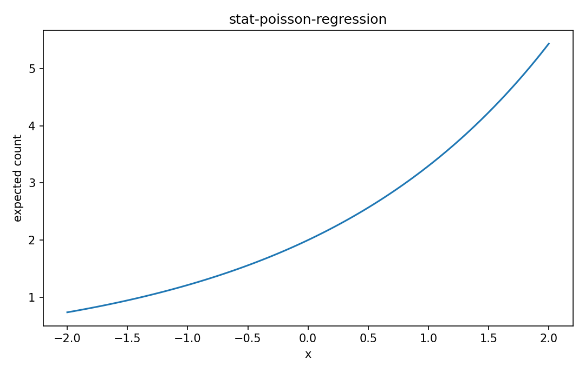

# Poisson regression

Fisher情報・統計推定

---

## 問い

count responseの期待rateを説明変数で正に保ちながらどうモデル化するか。

---

## 記号とshape

- `$Y_i`: count response (nonnegative integer)
- `$\lambda_i`: conditional mean/rate (positive)
- `$\boldsymbol\beta`: coefficients (p)

---

## 中心式

$$
Y_i\sim\mathrm{Poisson}(\lambda_i),\qquad \log\lambda_i=\mathbf x_i^{\mathsf T}\boldsymbol\beta
$$

---

## 導出

- Poisson likelihoodへsampleごとに異なるλ_iを入れる。
- positivityを保証するためcanonical log link $λ_i=e^{x_i^Tβ}$ を使う。
- scoreは $\sum_i\mathbf x_i(y_i-λ_i)$ となり、weighted HessianでNewton更新できる。

---

## 図

---

## 小さな例

1 predictor x、β0=log2、β1=0.5ならx=0でrate2、x=2でrate $2e^1\approx5.44$。

---

## 何がわかるか

photon count、failure count、traffic arrival、event rate解析。

---

## 失敗条件

variance≫meanならoverdispersion。negative binomial、random effect、robust covarianceなどを検討する。

---

## 実装検算

fitted meanとPearson residual varianceを比較し、dispersion ratioを診断する。

---

## 式の読み方を固定する

Poisson regressionでは、likelihoodまたはestimating equationから得られる局所曲率・感度と、推定量のばらつきを区別する。$Y_i$ は count response（nonnegative integer）、$\lambda_i$ は conditional mean/rate（positive）、$\boldsymbol\beta$ は coefficients（p）。中心式 `Y_i\sim\mathrm{Poisson}(\lambda_i),\qquad \log\lambda_i=\mathbf x_i^{\mathsf T}\boldsymbol\beta` の行列が大きい/小さいとはどのparameter方向についての話かをeigenvectorまで含めて読む。対角要素だけを見るとparameter間のtrade-offを失う。

---

## 極限・反例で検算

- 手計算例: 1 predictor x、β0=log2、β1=0.5ならx=0でrate2、x=2でrate $2e^1\approx5.44$。
- 失敗条件: variance≫meanならoverdispersion。negative binomial、random effect、robust covarianceなどを検討する。
- 実装検算: fitted meanとPearson residual varianceを比較し、dispersion ratioを診断する。

---

## 工学での位置づけ

photon count、failure count、traffic arrival、event rate解析。

中心式 `Y_i\sim\mathrm{Poisson}(\lambda_i),\qquad \log\lambda_i=\mathbf x_i^{\mathsf T}\boldsymbol\beta` のどの量が観測・未知parameter・weight・frequency成分に対応するかを区別する。

---

## 試験で書けるべきこと

- `Poisson regression` の記号とshapeを定義する
- `Poisson likelihoodへsampleごとに異なるλ_iを入れる。` から中心式を導く
- `1 predictor x、β0=log2、β1=0.5ならx=0でrate2、x=2でrate $2e^1\approx5.44$。` を最後まで追う
- `variance≫meanならoverdispersion。negative binomial、random effect、robust covarianceなどを検討する。` がなぜ問題か説明する

---

## 接続

Prerequisites: stat-generalized-linear-models, prob-poisson-distribution

[教科書](../../textbook/stat-poisson-regression)
[10問の演習](../../exercises/stat-poisson-regression)
