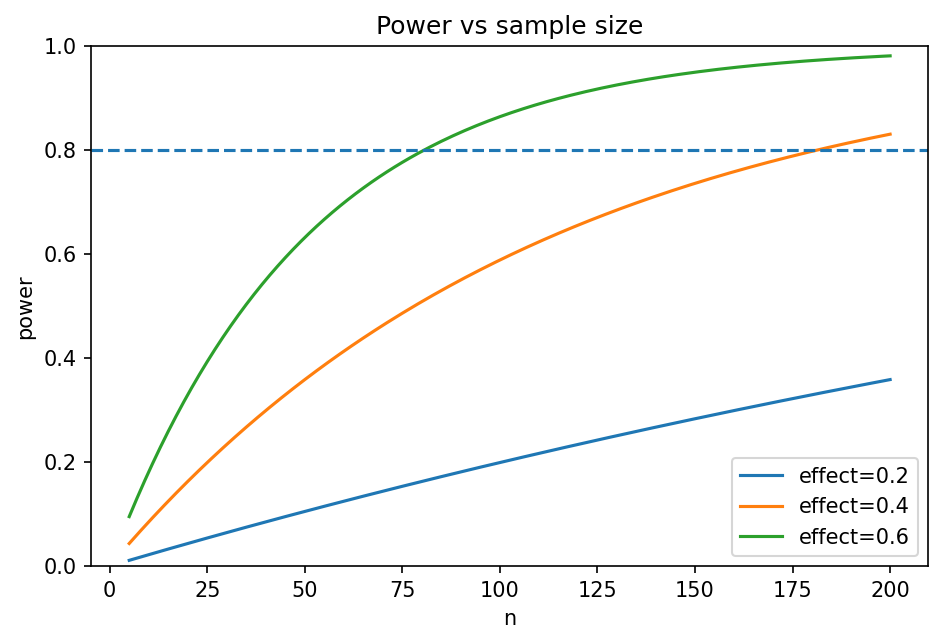

# 検定力と標本サイズ

Course 03｜確率統計

---

## 今回の問い

「有意差が出なかった」を、効果がない証拠とみなしてよいのはいつか。

---

## 直感

検定力は、実際に特定の効果があるときに帰無仮説を棄却できる確率。効果量・ノイズ・標本数・有意水準の関数で、事前のsample size設計につながる。

---

## 図解

---

## 中心式

$$
\text{power}(\delta)=P_{\theta=\theta_0+\delta}(\text{reject }H_0)
$$

---

## 導出

1. 棄却域をαで固定する。
2. 対立仮説の分布の下で、その棄却域に入る確率を計算する。
3. nを増やすと標準誤差が下がり、固定効果量に対するpowerが上がる。

---

## 小さい例

平均差δを検出したいとき、σが大きいほど同じpowerに必要なnは増える。

---

## 条件を外すと

- p>0.05を「効果なし」と断定しない。
- 事後に観測効果量だけからpowerを解釈しすぎない。

---

## 理解確認

- 式の各記号を定義できるか。
- 導出を1段ずつ再現できるか。
- 反例を1つ作れるか。

---

## 教科書と演習

[教科書](../../textbook/stat-power-sample-size)

[10問の演習](../../exercises/stat-power-sample-size)
