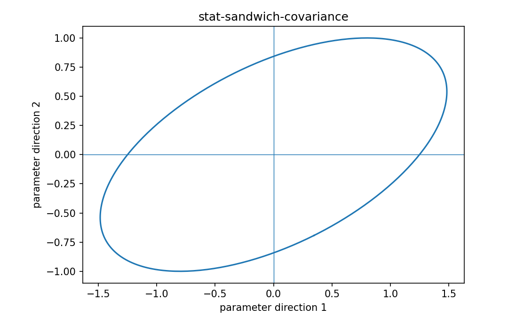

# Sandwich covariance

Fisher情報・統計推定

---

## 問い

likelihood/variance modelが多少誤っていても、estimating equationのばらつきからrobust covarianceをどう作るか。

---

## 記号とshape

- `$\mathbf A`: sensitivity / expected Jacobian of score (p\times p)
- `$\mathbf B`: score covariance (p\times p)
- `$\mathbf V_{sand}`: robust covariance (p\times p)

---

## 中心式

$$
\mathbf V_{sand}=\mathbf A^{-1}\mathbf B\mathbf A^{-\mathsf T}
$$

---

## 導出

- estimating equation $\sum_i\psi_i(\theta)=0$ の局所感度をAで表す。
- sample-to-sampleのscore fluctuationをBで表す。
- linearizationでparameter errorはA^{-1}を通るため、両側から挟んだcovarianceになる。

---

## 図

---

## 小さな例

正しく指定されたlikelihoodではinformation equalityによりA=B=Iとなり、sandwichはI^{-1}へ簡約する。

---

## 何がわかるか

heteroscedastic regression、model misspecification下の標準誤差、robust inference。

---

## 失敗条件

小標本ではsandwich estimator自体のbiasが大きいことがある。cluster構造があるならcluster-robust形式が必要。

---

## 実装検算

naive inverse Hessian covarianceとsandwich covarianceをheteroscedastic simulationで比較する。

---

## 式の読み方を固定する

Sandwich covarianceでは、likelihoodまたはestimating equationから得られる局所曲率・感度と、推定量のばらつきを区別する。$\mathbf A$ は sensitivity / expected Jacobian of score（p\times p）、$\mathbf B$ は score covariance（p\times p）、$\mathbf V_{sand}$ は robust covariance（p\times p）。中心式 `\mathbf V_{sand}=\mathbf A^{-1}\mathbf B\mathbf A^{-\mathsf T}` の行列が大きい/小さいとはどのparameter方向についての話かをeigenvectorまで含めて読む。対角要素だけを見るとparameter間のtrade-offを失う。

---

## 極限・反例で検算

- 手計算例: 正しく指定されたlikelihoodではinformation equalityによりA=B=Iとなり、sandwichはI^{-1}へ簡約する。
- 失敗条件: 小標本ではsandwich estimator自体のbiasが大きいことがある。cluster構造があるならcluster-robust形式が必要。
- 実装検算: naive inverse Hessian covarianceとsandwich covarianceをheteroscedastic simulationで比較する。

---

## 工学での位置づけ

heteroscedastic regression、model misspecification下の標準誤差、robust inference。

中心式 `\mathbf V_{sand}=\mathbf A^{-1}\mathbf B\mathbf A^{-\mathsf T}` のどの量が観測・未知parameter・weight・frequency成分に対応するかを区別する。

---

## 試験で書けるべきこと

- `Sandwich covariance` の記号とshapeを定義する
- `estimating equation $\sum_i\psi_i(\theta)=0$ の局所感度をAで表す。` から中心式を導く
- `正しく指定されたlikelihoodではinformation equalityによりA=B=Iとなり、sandwichはI^{-1}へ簡約する。` を最後まで追う
- `小標本ではsandwich estimator自体のbiasが大きいことがある。cluster構造があるならcluster-robust形式が必要。` がなぜ問題か説明する

---

## 接続

Prerequisites: stat-generalized-linear-models, stat-covariance-estimation

[教科書](../../textbook/stat-sandwich-covariance)
[10問の演習](../../exercises/stat-sandwich-covariance)
