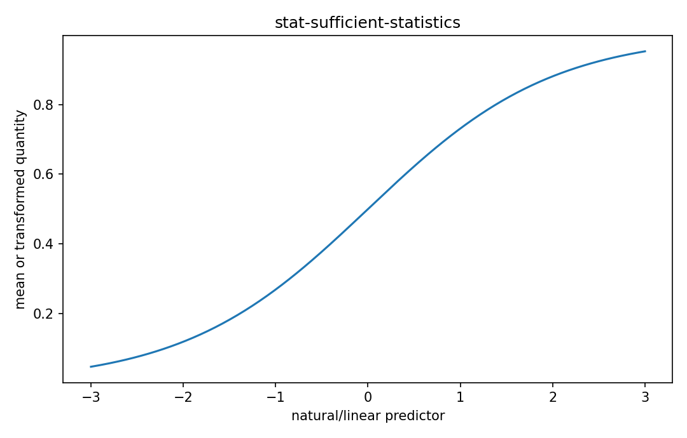

# 十分統計量

Fisher情報・統計推定

---

## 問い

parameter推定に必要なdata情報を、損失なく低次元要約できる条件は何か。

---

## 記号とshape

- `$T(y)`: statistic (compressed data)
- `$g`: theta-dependent factor (scalar)
- `$h`: theta-independent factor (scalar)

---

## 中心式

$$
p(\mathbf y\mid\theta)=g(T(\mathbf y),\theta)h(\mathbf y)
$$

---

## 導出

- likelihood factorization theoremを使う。
- parameter依存部分がdataを $T(\mathbf y)$ 経由でしか見ないなら、conditional distribution of data given Tはθに依存しない。
- したがってTはθについてlikelihood情報を失わない。

---

## 図

---

## 小さな例

Poisson iid sample $X_i\sim Pois(\lambda)$ ではlikelihoodは $e^{-n\lambda}\lambda^{\sum x_i}/\prod x_i!$ なので $\sum X_i$ が十分統計量。

---

## 何がわかるか

streaming estimation、data compression、exponential family理解の基礎。

---

## 失敗条件

「情報を失わない」は任意目的に対してではなくparameter θの推定というmodel内の意味。model misspecification下では別。

---

## 実装検算

raw dataとsufficient statisticだけからMLEが同じになる例をコードで確かめる。

---

## 式の読み方を固定する

十分統計量では、likelihoodまたはestimating equationから得られる局所曲率・感度と、推定量のばらつきを区別する。$T(y)$ は statistic（compressed data）、$g$ は theta-dependent factor（scalar）、$h$ は theta-independent factor（scalar）。中心式 `p(\mathbf y\mid\theta)=g(T(\mathbf y),\theta)h(\mathbf y)` の行列が大きい/小さいとはどのparameter方向についての話かをeigenvectorまで含めて読む。対角要素だけを見るとparameter間のtrade-offを失う。

---

## 極限・反例で検算

- 手計算例: Poisson iid sample $X_i\sim Pois(\lambda)$ ではlikelihoodは $e^{-n\lambda}\lambda^{\sum x_i}/\prod x_i!$ なので $\sum X_i$ が十分統計量。
- 失敗条件: 「情報を失わない」は任意目的に対してではなくparameter θの推定というmodel内の意味。model misspecification下では別。
- 実装検算: raw dataとsufficient statisticだけからMLEが同じになる例をコードで確かめる。

---

## 工学での位置づけ

streaming estimation、data compression、exponential family理解の基礎。

中心式 `p(\mathbf y\mid\theta)=g(T(\mathbf y),\theta)h(\mathbf y)` のどの量が観測・未知parameter・weight・frequency成分に対応するかを区別する。

---

## 試験で書けるべきこと

- `十分統計量` の記号とshapeを定義する
- `likelihood factorization theoremを使う。` から中心式を導く
- `Poisson iid sample $X_i\sim Pois(\lambda)$ ではlikelihoodは $e^{-n\lambda}\lambda^{\sum x_i}/\prod x_i!$ なので $\sum X_i$ が十分統計量。` を最後まで追う
- `「情報を失わない」は任意目的に対してではなくparameter θの推定というmodel内の意味。model misspecification下では別。` がなぜ問題か説明する

---

## 接続

Prerequisites: stat-likelihood-maximum-likelihood, prob-conditional-probability-independence

[教科書](../../textbook/stat-sufficient-statistics)
[10問の演習](../../exercises/stat-sufficient-statistics)
