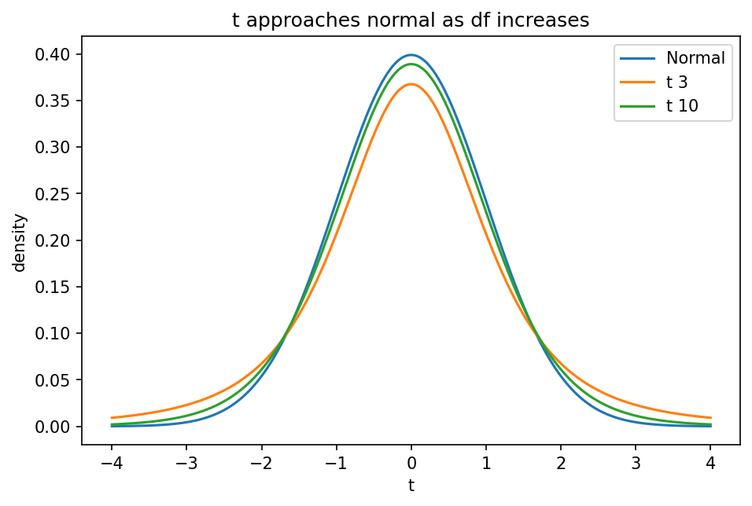

# t分布・χ²分布と標本分布

Course 03｜確率統計

---

## 今回の問い

母分散が未知のとき、なぜ標準正規ではなくt分布が現れるのか。

---

## 直感

平均の標準化に未知σの代わりに標本標準偏差Sを使うと、分母にもランダム性が入る。その追加不確実性がt分布の厚い裾として現れる。

---

## 図解

---

## 中心式

$$
T=\frac{\bar X-\mu}{S/\sqrt n}\sim t_{n-1}
$$

---

## 導出

1. 正規母集団では $Z=(\bar X-\mu)/(\sigma/\sqrt n)\sim N(0,1)$。
2. $(n-1)S^2/\sigma^2\sim\chi^2_{n-1}$ かつ Z と S² は独立。
3. $T=Z/\sqrt{U/\nu}$ の定義からt分布が得られる。

---

## 小さい例

n=10なら自由度9。95%両側区間の臨界値は1.96より大きくなり、σ推定の不確実性を反映して区間が広がる。

---

## 条件を外すと

- 非正規・極小標本でt公式を無条件適用しない。
- 標準偏差Sと標準誤差S/√nを区別する。

---

## 理解確認

- 式の各記号を定義できるか。
- 導出を1段ずつ再現できるか。
- 反例を1つ作れるか。

---

## 教科書と演習

[教科書](../../textbook/stat-t-chi-square-sampling-distributions)

[10問の演習](../../exercises/stat-t-chi-square-sampling-distributions)
