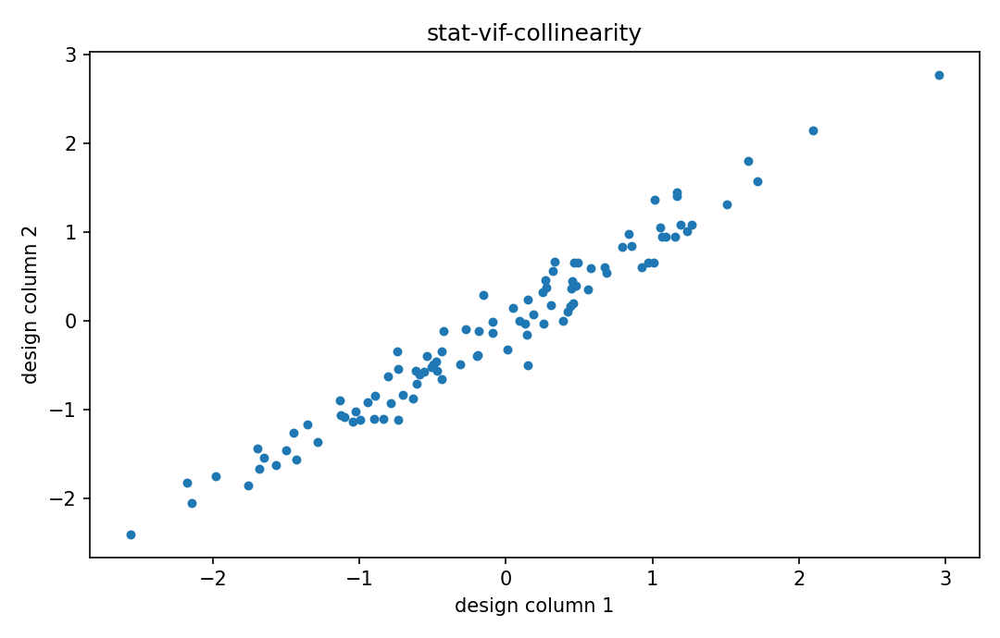

# VIFとcollinearity

Fisher情報・統計推定

---

## 問い

設計列が似ることで回帰係数varianceがどれだけ膨らむかをどう定量化するか。

---

## 記号とshape

- `$R_j^2`: column j regressed on other columns: coefficient of determination ([0,1))
- `$VIF_j`: variance inflation factor (>=1)

---

## 中心式

$$
\operatorname{VIF}_j=\frac{1}{1-R_j^2}
$$

---

## 導出

- OLS covarianceは $\sigma^2(\mathbf X^{\mathsf T}\mathbf X)^{-1}$。
- 第j列を他列へ回帰した残差normが小さいほど、独自情報が少ない。
- その比を整理するとvariance inflationが $1/(1-R_j^2)$ で表せる。

---

## 図

---

## 小さな例

$R_j^2=0.9$ ならVIF=10で、標準誤差は独立設計と比べ概ね $\sqrt{10}\approx3.16$ 倍のscaleで膨らむ。

---

## 何がわかるか

spectral unmixingの似たsignature、multi-sensor calibration、regression diagnostics。

---

## 失敗条件

VIF thresholdを機械的に絶対基準として使わない。標準化・model目的・sample sizeで解釈は変わる。

---

## 実装検算

各columnを他列へleast squaresし、R²由来VIFとinverse correlation matrix対角を照合する。

---

## 式の読み方を固定する

VIFとcollinearityでは、likelihoodまたはestimating equationから得られる局所曲率・感度と、推定量のばらつきを区別する。$R_j^2$ は column j regressed on other columns: coefficient of determination（[0,1)）、$VIF_j$ は variance inflation factor（>=1）。中心式 `\operatorname{VIF}_j=\frac{1}{1-R_j^2}` の行列が大きい/小さいとはどのparameter方向についての話かをeigenvectorまで含めて読む。対角要素だけを見るとparameter間のtrade-offを失う。

---

## 極限・反例で検算

- 手計算例: $R_j^2=0.9$ ならVIF=10で、標準誤差は独立設計と比べ概ね $\sqrt{10}\approx3.16$ 倍のscaleで膨らむ。
- 失敗条件: VIF thresholdを機械的に絶対基準として使わない。標準化・model目的・sample sizeで解釈は変わる。
- 実装検算: 各columnを他列へleast squaresし、R²由来VIFとinverse correlation matrix対角を照合する。

---

## 工学での位置づけ

spectral unmixingの似たsignature、multi-sensor calibration、regression diagnostics。

中心式 `\operatorname{VIF}_j=\frac{1}{1-R_j^2}` のどの量が観測・未知parameter・weight・frequency成分に対応するかを区別する。

---

## 試験で書けるべきこと

- `VIFとcollinearity` の記号とshapeを定義する
- `OLS covarianceは $\sigma^2(\mathbf X^{\mathsf T}\mathbf X)^{-1}$。` から中心式を導く
- `$R_j^2=0.9$ ならVIF=10で、標準誤差は独立設計と比べ概ね $\sqrt{10}\approx3.16$ 倍のscaleで膨らむ。` を最後まで追う
- `VIF thresholdを機械的に絶対基準として使わない。標準化・model目的・sample sizeで解釈は変わる。` がなぜ問題か説明する

---

## 接続

Prerequisites: stat-estimator-covariance, mat-gram-matrix

[教科書](../../textbook/stat-vif-collinearity)
[10問の演習](../../exercises/stat-vif-collinearity)
