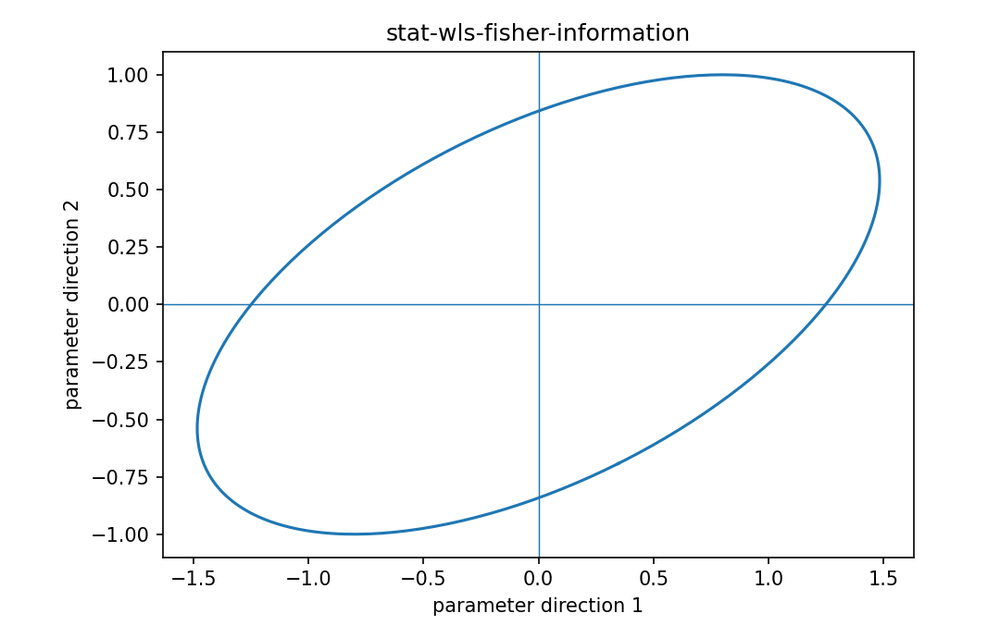

# WLSのFisher情報

Fisher情報・統計推定

---

## 問い

detectorごと・sampleごとにnoise varianceが異なるとき、情報行列をどう重み付けするか。

---

## 記号とshape

- `$\mathbf X`: design/signature matrix (m\times p)
- `$\mathbf\Sigma`: noise covariance (m\times m)
- `$\mathbf W=\mathbf\Sigma^{-1}`: precision matrix (m\times m)

---

## 中心式

$$
\mathbf I(\boldsymbol\beta)=\mathbf X^{\mathsf T}\mathbf\Sigma^{-1}\mathbf X=\mathbf X^{\mathsf T}\mathbf W\mathbf X
$$

---

## 導出

- Gaussian model $\mathbf y\sim N(\mathbf X\boldsymbol\beta,\mathbf\Sigma)$ のlog-likelihoodを書く。
- $\boldsymbol\beta$ で二回微分するとHessianは $-\mathbf X^{\mathsf T}\mathbf\Sigma^{-1}\mathbf X$。
- negative expectationを取っても同じなのでWLS information matrixになる。

---

## 図

---

## 小さな例

$\mathbf W=\operatorname{diag}(1,0.25)$ なら第2measurementはvarianceが4倍で情報寄与が1/4になる。

---

## 何がわかるか

Poisson-like detector noiseを考慮したspectral unmixing、heteroscedastic regression、sensor fusion。

---

## 失敗条件

weightを観測値から推定してparameter依存する場合、固定Wの単純式だけではcovarianceを完全に表さない。

---

## 実装検算

`X.T @ W @ X` の固有値をcell/sampleごとに比較し、weak information方向を調べる。

---

## 式の読み方を固定する

WLSのFisher情報では、likelihoodまたはestimating equationから得られる局所曲率・感度と、推定量のばらつきを区別する。$\mathbf X$ は design/signature matrix（m\times p）、$\mathbf\Sigma$ は noise covariance（m\times m）、$\mathbf W=\mathbf\Sigma^{-1}$ は precision matrix（m\times m）。中心式 `\mathbf I(\boldsymbol\beta)=\mathbf X^{\mathsf T}\mathbf\Sigma^{-1}\mathbf X=\mathbf X^{\mathsf T}\mathbf W\mathbf X` の行列が大きい/小さいとはどのparameter方向についての話かをeigenvectorまで含めて読む。対角要素だけを見るとparameter間のtrade-offを失う。

---

## 極限・反例で検算

- 手計算例: $\mathbf W=\operatorname{diag}(1,0.25)$ なら第2measurementはvarianceが4倍で情報寄与が1/4になる。
- 失敗条件: weightを観測値から推定してparameter依存する場合、固定Wの単純式だけではcovarianceを完全に表さない。
- 実装検算: `X.T @ W @ X` の固有値をcell/sampleごとに比較し、weak information方向を調べる。

---

## 工学での位置づけ

Poisson-like detector noiseを考慮したspectral unmixing、heteroscedastic regression、sensor fusion。

中心式 `\mathbf I(\boldsymbol\beta)=\mathbf X^{\mathsf T}\mathbf\Sigma^{-1}\mathbf X=\mathbf X^{\mathsf T}\mathbf W\mathbf X` のどの量が観測・未知parameter・weight・frequency成分に対応するかを区別する。

---

## 試験で書けるべきこと

- `WLSのFisher情報` の記号とshapeを定義する
- `Gaussian model $\mathbf y\sim N(\mathbf X\boldsymbol\beta,\mathbf\Sigma)$ のlog-likelihoodを書く。` から中心式を導く
- `$\mathbf W=\operatorname{diag}(1,0.25)$ なら第2measurementはvarianceが4倍で情報寄与が1/4になる。` を最後まで追う
- `weightを観測値から推定してparameter依存する場合、固定Wの単純式だけではcovarianceを完全に表さない。` がなぜ問題か説明する

---

## 接続

Prerequisites: mat-wls-inverse-variance, stat-fisher-information-matrix, stat-estimator-covariance

[教科書](../../textbook/stat-wls-fisher-information)
[10問の演習](../../exercises/stat-wls-fisher-information)
